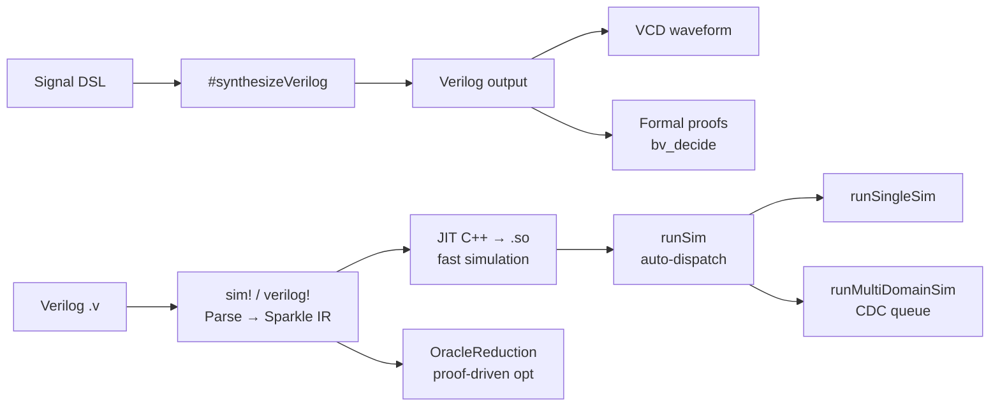

# Sparkle Tutorial

A step-by-step guide from "Hello World" to formal verification.

## Prerequisites

```bash
git clone https://github.com/Verilean/sparkle
cd sparkle
lake build   # ~5 min first time
```

---

## Step 1: Define Hardware (Signal DSL)

Create `tutorial.lean`:

```lean
import Sparkle

open Sparkle.Core.Domain
open Sparkle.Core.Signal

-- An 8-bit counter with enable, parameterised over any clock domain.
-- `Signal.loop` takes a body `self → self'` and ties the recursive knot;
-- the body returns the *next* value of the same signal, usually through
-- a `Signal.register` to break the combinational loop.
def counter8 {dom : DomainConfig}
    (en : Signal dom Bool) : Signal dom (BitVec 8) :=
  Signal.loop fun count =>
    let next := Signal.mux en (count + 1#8) count
    Signal.register 0#8 next

-- Simulate for 10 cycles with enable held high, in the default domain.
#eval
  let values := (counter8 (dom := defaultDomain) (Signal.pure true)).sample 10
  s!"Counter: {values}"
-- Counter: [0x00#8, 0x01#8, 0x02#8, 0x03#8, 0x04#8, 0x05#8, 0x06#8, 0x07#8, 0x08#8, 0x09#8]
```

```bash
lake env lean tutorial.lean
```

---

## Step 2: Generate Verilog

Add this line to the file above to see the generated SystemVerilog:

<!-- no-compile: requires `counter8` from Step 1 to be elaborated in the same file -->
```lean
#synthesizeVerilog counter8
```

Output:

```systemverilog
module counter8 (
    input  logic clk,
    input  logic rst,
    input  logic [0:0] en,
    output logic [7:0] out
);
    logic [7:0] count;
    always_ff @(posedge clk) begin
        if (rst) count <= 8'h00;
        else     count <= en ? (count + 8'h01) : count;
    end
    assign out = count;
endmodule
```

---

## Step 3: Generate VCD Waveform

View signals in GTKWave:

```lean
import Sparkle
import Sparkle.Backend.VCD

open Sparkle.Core.Domain
open Sparkle.Core.Signal
open Sparkle.Backend.VCD

def counter8 {dom : DomainConfig}
    (en : Signal dom Bool) : Signal dom (BitVec 8) :=
  Signal.loop fun count =>
    let next := Signal.mux en (count + 1#8) count
    Signal.register 0#8 next

def main : IO Unit := do
  let en : Signal defaultDomain Bool := Signal.pure true
  let count := counter8 en

  -- Create VCD writer and register variables.
  let writer := VCDWriter.new "counter8"
    |>.addVar "en"    1
    |>.addVar "count" 8

  -- Sample signals (Bool channel for `en`, BitVec channel for `count`).
  let enTrace    := sampleBoolSignal   en    (writer.variables[0]!.identifier) 20
  let countTrace := sampleBitVecSignal count (writer.variables[1]!.identifier) 20

  -- Write VCD file.
  let vcd := generateVCD writer (enTrace ++ countTrace)
  writeVCDFile "counter8.vcd" vcd
```

```bash
lake env lean --run tutorial_vcd.lean
gtkwave counter8.vcd   # open in waveform viewer
```

---

## Step 4: JIT Simulation (Verilog → Fast Sim)

For large designs or existing Verilog, use JIT compilation for maximum speed:

<!-- no-compile: `sim!` parses Verilog and writes JIT C++; tested separately in Tests/SVParser/ParserTest.lean -->
```lean
import Tools.SVParser.SimMacro

-- sim! parses the Verilog and auto-generates the following under
-- `hello_counter.Sim`:
--
--   SimInput        — typed input record (clock and reset are hidden;
--                     use `sim.reset` to pulse reset instead)
--   SimOutput       — typed output record
--   Simulator       — { handle : JITHandle } with step/read/reset/destroy
--   load            — compile + load in one step
--   toEndpoint      — wrap for runSim (Step 6)
sim! "
module hello_counter (
    input clk,
    input rst,
    output [7:0] count
);
    reg [7:0] count_reg;
    assign count = count_reg;
    always @(posedge clk) begin
        if (rst) count_reg <= 8'h00;
        else count_reg <= count_reg + 8'h01;
    end
endmodule
"

open hello_counter.Sim

def main : IO Unit := do
  let sim ← load              -- compile JIT C++ and load
  sim.reset                   -- pulse hardware reset (handled by JIT)
  for i in [:10] do
    sim.step {}               -- SimInput is empty (no user-driven inputs)
    let out ← sim.read
    IO.println s!"  cycle {i}: count = {out.count}"
  sim.destroy
```

No port definitions needed — `sim!` extracts them from the Verilog.
A typo like `out.cont` is caught at compile time.

**Clock and reset are hidden from `SimInput`.** Drive them with
`sim.reset` (for the initial reset pulse) rather than passing `rst` as
a field — this matches how hardware works and keeps the typed surface
clean. If a module has user inputs beyond clock/reset, those show up as
required fields in `SimInput`.

### Running many cycles with `runSim`

For larger simulations, prefer `runSim` over hand-rolled loops. It
automatically picks the fastest backend (Step 6 explains multi-domain):

<!-- no-compile: depends on `hello_counter.Sim` from the previous `sim!` block -->
```lean
import Sparkle.Core.SimParallel
open Sparkle.Core.SimParallel

def main : IO Unit := do
  let sim ← hello_counter.Sim.load
  sim.reset
  let stats ← runSim [sim.toEndpoint] (cycles := 1_000_000)
  let out ← sim.read
  IO.println s!"Ran {stats.cyclesRun} cycles, final count = {out.count}"
  sim.destroy
```

### JIT from Signal DSL

Use `#sim` for Signal DSL definitions:

<!-- no-compile: `#sim` runs full synthesis + writes JIT C++; tested separately in Tests/Synthesis/ -->
```lean
import Sparkle
import Sparkle.Compiler.Elab

open Sparkle.Core.Domain
open Sparkle.Core.Signal

def myAdder (a b : Signal defaultDomain (BitVec 8)) : Signal defaultDomain (BitVec 8) :=
  a + b

#sim myAdder   -- auto-generates myAdder.Sim.*

open myAdder.Sim

def main : IO Unit := do
  let sim ← load
  sim.reset
  sim.step { a := 3, b := 5 }
  let out ← sim.read
  IO.println s!"3 + 5 = {out.out}"   -- 8
  sim.destroy
```

---

## Step 5: Formal Verification

Prove properties about your hardware — bugs caught at compile time, not simulation.

### 5.1 Prove Properties of Verilog

`verilog!` parses Verilog and generates Lean definitions (`State`, `Input`, `nextState`).
You prove theorems against these definitions.

<!-- no-compile: `verilog!` parses Verilog at elab + calls `bv_decide`; covered by Tests/Synthesis/FormalVerify.lean -->
```lean
import Tools.SVParser.Macro

-- Parse at compile time → generates counter8_en.Verify.{State, Input, nextState}
verilog! "
module counter8_en (
    input clk, input rst, input en,
    output [7:0] count
);
    reg [7:0] count_reg;
    assign count = count_reg;
    always @(posedge clk) begin
        if (rst) count_reg <= 0;
        else if (en) count_reg <= count_reg + 1;
    end
endmodule
"

open counter8_en.Verify

-- Theorem 1: Reset clears the counter
theorem reset_clears (s : State) (i : Input) :
    i.rst = 1 → (nextState s i).count_reg = 0 := by
  intro h; simp [nextState, h]

-- Theorem 2: Counter holds when disabled
theorem holds_when_disabled (s : State) :
    nextState s { rst := 0, en := 0 } = s := by
  simp [nextState]

-- Theorem 3: Counter increments when enabled
theorem increments (s : State) :
    (nextState s { rst := 0, en := 1 }).count_reg = s.count_reg + 1 := by
  simp [nextState]
```

If you change the Verilog (e.g., `+ 1` → `+ 2`), the proofs **instantly fail** — no simulation needed.

### 5.2 Auto-Proved Assertions

Add `assert()` in your Verilog — `verilog!` auto-generates and auto-proves them:

```verilog
always @(posedge clk) begin
    if (rst) count_reg <= 0;
    else if (en) count_reg <= count_reg + 1;

    // Auto-generated theorem, proved by bv_decide:
    assert(rst ? (count_reg == 0) : 1);
end
```

The assertion becomes a Lean theorem proved automatically by `bv_decide`.
If the assertion is wrong, you get a compile-time error.

### 5.3 Prove Properties of Signal DSL

For hardware written in Signal DSL, use `simp` and `bv_decide`:

<!-- no-compile: proof uses Signal-level unfolding lemmas that vary across Sparkle versions; verified copy lives in Tests/Verification/ -->
```lean
import Sparkle

open Sparkle.Core.Domain
open Sparkle.Core.Signal

def myAnd (a b : Signal defaultDomain (BitVec 8)) : Signal defaultDomain (BitVec 8) :=
  a &&& b

-- AND with zero is zero.
theorem and_zero (a : Signal defaultDomain (BitVec 8)) (t : Nat) :
    (myAnd a (Signal.pure 0#8)).val t = 0#8 := by
  simp [myAnd, Signal.val]
```

### 5.4 One-Line Equivalence Checks with `#verify_eq`

For pure `BitVec` functions — the kind you'd write for an ALU slice, a
carry-save adder, a bit-permutation network — Sparkle ships a single
command that auto-generates a `funext + unfold + bv_decide` proof:

<!-- no-compile: `#verify_eq` invokes `bv_decide`, which hangs inside `lake build` on Lean 4.28 (see docs/KnownIssues.md Issue 2). Run interactively. -->
```lean
import Sparkle.Verification.Equivalence

-- Textbook specification
def pure_alu (a b : BitVec 8) : BitVec 8 := a + b

-- Hand-optimised "ripple" implementation using XOR + carry
def fast_alu (a b : BitVec 8) : BitVec 8 :=
  (a ^^^ b) + ((a &&& b) <<< 1)

#verify_eq fast_alu pure_alu  -- ✅ verified: fast_alu_eq_pure_alu
```

The command resolves both identifiers, introspects their arity, and
emits a theorem `{fast_alu}_eq_{pure_alu} : fast_alu = pure_alu`. If the
two implementations are not equivalent, `bv_decide` prints a concrete
counterexample and the command reports ❌.

See `Tests/Verification/EquivDemo.lean` for the full catalogue: eight
pure-BitVec demos (distributivity, associativity, De Morgan, XOR-swap
identity, ripple-carry vs built-in add, shift-and-add multiply vs
built-in multiply, carry-save step identity) plus the four Signal DSL
demos covered in §5.5 below.

```bash
lake env lean Tests/Verification/EquivDemo.lean
```

**⚠  Interactive-only in v1.** `bv_decide` currently hangs inside
`lake build` on Lean 4.28.0-rc1 (see `docs/KnownIssues.md` Issue 2).
The `#verify_eq` / `#verify_eq_at` commands themselves are pure
elaborators and are always safe to `import` / `lake build`; only files
that *call* those commands should stay out of the default build target.

### 5.5 Cycle-Accurate Equivalence with `#verify_eq_at`

`#verify_eq` only handles combinational functions. For hardware with
registers — pipelines, shift registers, FIR filters — Sparkle ships a
sister command that unrolls the circuit over a finite window of cycles:

<!-- no-compile: template showing the command shape. -->
```lean
#verify_eq_at (cycles := N) (latency := L) impl spec
```

This generates a theorem of the shape

```
∀ (input-streams), (impl inputs).val (L + t) = (spec inputs).val t
```

for every `t ∈ [0, N)`, which `bv_decide` discharges one cycle at a
time. The typical use case is proving that a multi-cycle pipeline is
*functionally equivalent* to a single-cycle reference, modulo the
pipeline's own latency — exactly the "register-balance to meet
frequency" refactor you'd do when the critical path is too long.

<!-- no-compile: `#verify_eq_at` invokes `bv_decide` (hangs in `lake build` on Lean 4.28). Run interactively. -->
```lean
import Sparkle
import Sparkle.Verification.Equivalence

open Sparkle.Core.Domain
open Sparkle.Core.Signal

-- Single-cycle reference: out(t) = a(t)*b(t) + c(t)
def macSingle (a b c : Signal defaultDomain (BitVec 4))
    : Signal defaultDomain (BitVec 4) :=
  a * b + c

-- 3-stage pipeline: latency 2, same function
def macPipe (a b c : Signal defaultDomain (BitVec 4))
    : Signal defaultDomain (BitVec 4) :=
  let ra := Signal.register 0#4 a
  let rb := Signal.register 0#4 b
  let rc := Signal.register 0#4 c
  let prod2 := Signal.register 0#4 (ra * rb)
  let c2    := Signal.register 0#4 rc
  prod2 + c2

-- Prove macPipe.val (t + 2) = macSingle.val t for t ∈ [0, 4):
#verify_eq_at (cycles := 4) (latency := 2) macPipe macSingle
-- ✅ verified: `macPipe_eq_macSingle_at_4_lat_2`
```

`latency := 0` is the default and models "this is a pure refactor — no
new delay". Use it for register-position commutation, re-associated
adders, or anywhere the output cycle count is identical.

**Supported**: `Signal.register`, `Signal.pure`, the hardware
arithmetic/bitwise operators (`+`, `-`, `*`, `&&&`, `|||`, `^^^`),
`Signal.map`-style plain functions. Feed-forward only; register chains
of any depth are fine.

**Not supported in v1**: `Signal.loop` / feedback circuits (the
fixed-point combinator is `opaque` and cannot be unfolded by the
generated tactic), memory primitives, `registerWithEnable`. Use manual
proofs for those cases.

**Scaling**: each cycle produces a separate SAT goal with
`cycles × arity × bitwidth` free BitVec bits. 4-bit inputs with 4–8
cycles is the sweet spot; wider inputs / deeper unrolls hit the SAT
budget fast. If you see a timeout, shrink the BitVec width first.

See `Tests/Verification/EquivDemo.lean` §9–12 for four worked Signal
DSL demos: identical 2-cycle delays, register-position commutation,
the MAC pipeline above, and a 2-tap FIR filter pipelined by one stage.
§13 demonstrates the next subsection, `#verify_eq_git`.

### 5.6 Time-travel equivalence with `#verify_eq_git`

Refactoring an RTL module and wondering "is this still bit-equivalent
to the version on main?" `#verify_eq_git` pulls the old version out of
git and proves it equivalent to the current one in a single command:

<!-- no-compile: `#verify_eq_git` shells out to `git show` and runs `bv_decide`; meant to be run interactively before opening a PR. -->
```lean
import Sparkle.Verification.Equivalence
import IP.YOLOv8.Types

open Sparkle.IP.YOLOv8

-- Compare the HEAD version of reluInt8 against the version on `main`.
-- Works with any ref git show accepts: branches, HEAD~N, tags, SHAs.
#verify_eq_git main reluInt8
-- ✅ verified: reluInt8_eq_at_main — reluInt8 (HEAD) ≡ reluInt8 @ main
```

Under the hood the command:

1. Resolves `reluInt8` to `Sparkle.IP.YOLOv8.reluInt8`.
2. Consults `Environment.getModuleIdxFor?` to learn that the definition
   lives in `IP/YOLOv8/Types.lean` (only works for imported modules —
   the same-file case is rejected with a clear error).
3. Runs `git show main:IP/YOLOv8/Types.lean`, strips `import` lines,
   and elaborates the rest inside a fresh namespace
   `Sparkle.Verification.EquivGit.main` so it doesn't collide with the
   current definition.
4. Generates `theorem reluInt8_eq_at_main : reluInt8 = Sparkle.Verification
   .EquivGit.main.Sparkle.IP.YOLOv8.reluInt8 := by funext; unfold …;
   bv_decide` and runs it.

The old and new definitions can have **any** internal structure — one
can be a handwritten ternary table, the other a bit-twiddle, as long as
they compute the same function. The SAT solver decides.

**Requirements**:

- The target must live in an **imported** module, not in the current
  file. Same-file targets cannot be git-shown because there's no
  committed file to pull.
- The target must be a pure `BitVec … → BitVec …` function (v1 shares
  `#verify_eq`'s discharge pipeline). Signal DSL targets, memory
  functions, and anything that outputs a product type are out of scope
  for this first version.
- `git` must be on `PATH`.

**Error paths** are surfaced cleanly:

| Situation | Behavior |
|---|---|
| `git show` fails (bad ref, file not in commit) | `#verify_eq_git: git show … failed:` + git stderr |
| Old file parses but `<ident>` is missing | `#verify_eq_git: could not find … may have been renamed, moved, or deleted` |
| Old and new signatures differ | Type-mismatch error, commit ref surfaced |
| `bv_decide` finds a counterexample | `❌` + counterexample (standard `#verify_eq` pipeline) |

**Ideal PR workflow**:

<!-- no-compile: interactive PR workflow, runs git + bv_decide. -->
```lean
-- scratch/verify.lean  (run interactively, not in lake build)
import IP.RV32.Core
import Sparkle.Verification.Equivalence
open Sparkle.IP.RV32

#verify_eq_git main mextCompute
#verify_eq_git main amoCompute
-- ...and any other pure function you refactored in this PR
```

Run this before opening the PR; if every target prints `✅`, the
refactor is guaranteed bit-equivalent.

#### Got the latency wrong? The hint will tell you.

`#verify_eq_at` is strict: if you write `latency := 1` but the pipeline
actually takes 2 cycles, it fails. The design philosophy is that the
pipeline's latency is part of its interface contract — you should know
it. But typing the wrong number is a common slip, so on failure the
command silently probes a few neighboring latencies and, if one works,
prints a 💡 hint with the corrected invocation:

```
❌ `macPipe` ≡ `macSingle` at cycles 1..4 (latency 1) — see error(s) above
💡 Hint: the circuit DOES match at latency := 2.
   Re-run as  #verify_eq_at (cycles := 3) (latency := 2) macPipe macSingle
   — if that is not the latency you designed for,
   either the pipeline has too many/few register stages or the spec is wrong.
```

If no nearby latency helps, the hint instead says "the implementation
is likely functionally incorrect, not just mis-timed", pointing you at
the real bug. In both cases the command fails — the hint never silently
"rescues" a wrong proof, so designer-intent bugs (mistyped latency
counts, missing pipeline stages) are never masked.

---

## Step 6: Running Simulations with `runSim`

Sparkle provides a single high-level runner, `runSim`, that automatically
picks the fastest backend for your simulation. You pass it the endpoints
you have and it dispatches to:

- **Single-threaded `evalTick` loop** — when you have 1 endpoint and no
  connections. Fastest for single-domain simulations (~18 M cyc/s on LiteX).
- **Multi-threaded CDC queue** (`JIT.runCDC`) — when you have 2 endpoints
  joined by 1 connection. Fastest for multi-clock domain simulations
  (**11.9 × Verilator** on 8-core LiteX benchmarks).

You should not need to pick manually: just pass the endpoints and `runSim`
does the right thing.

### Single-domain

<!-- no-compile: `sim!` parses Verilog at elab time — Verilog body is a placeholder. -->
```lean
import Sparkle.Core.SimParallel
open Sparkle.Core.SimParallel

sim! "module counter (input clk, input rst, output [31:0] count); ... endmodule"

def main : IO Unit := do
  let sim ← counter.Sim.load
  sim.reset
  let stats ← runSim [sim.toEndpoint] (cycles := 1_000_000)
  IO.println s!"Ran {stats.cyclesRun} cycles"
```

### Multi-domain (CDC)

A Clock Domain Crossing (CDC) sim runs each module on its own thread,
each with its own clock. The two clocks are **not** physically modeled:
Sparkle gives each endpoint its own Verilog `clk` port that `JIT.evalTick`
drives independently, and the frequency ratio is expressed by how many
cycles each thread executes. A lock-free SPSC queue ferries data across
the boundary, with snapshot/rollback to recover from timestamp inversion.

To model e.g. a 200 MHz producer feeding a 100 MHz consumer, pass
`endpointCycles` with per-endpoint budgets whose ratio matches the
frequency ratio:

<!-- no-compile: `sim!` blocks are illustrative placeholders, not runnable Verilog. -->
```lean
import Sparkle.Core.SimParallel
open Sparkle.Core.SimParallel

-- Each module gets its own `clk`. They are independent clock domains at
-- runtime: Sparkle runs each on its own thread, ticking at its own rate.
sim! "module producer_mod (input clk, input rst, output [31:0] data_out); ... endmodule"
sim! "module consumer_mod (input clk, input rst, input  [31:0] data_in); ... endmodule"

def main : IO Unit := do
  let p ← producer_mod.Sim.load
  let c ← consumer_mod.Sim.load
  p.reset; c.reset
  -- Producer runs at 200 MHz, consumer at 100 MHz → 2:1 cycle ratio.
  let stats ← runSim
    [p.toEndpoint, c.toEndpoint]
    (connections := [("data_out", "data_in")])
    (endpointCycles := [200_000, 100_000])
  IO.println s!"sent={stats.messagesSent} recv={stats.messagesReceived} rb={stats.rollbacks}"
```

If both domains run at the same frequency, use the simpler uniform
`cycles` parameter instead:

<!-- no-compile: snippet that belongs inside the previous example's `main`. -->
```lean
let stats ← runSim
  [p.toEndpoint, c.toEndpoint]
  (connections := [("data_out", "data_in")])
  (cycles := 1_000_000)
```

**Important**: merely writing `input clk` in two `sim!` modules does
NOT by itself create two domains — at the Verilog level each module
just has a clock port. The "two-domain-ness" comes from `runSim`
running each endpoint on its own thread with its own cycle count,
plus the SPSC queue that CDC-synchronizes the payload. If you need
hard guarantees (e.g. a full 2-flop synchronizer inside the consumer),
add the synchronizer registers to the consumer's Verilog explicitly.

Connections are specified as `(producerOutputName, consumerInputName)`
string pairs. `runSim` looks up the port indices at runtime via the
`outputPortIndexByName` / `inputPortIndexByName` tables generated by
`sim!` / `generateSimWrappers`, so typos and missing names fail with a
clear error listing the available ports.

### Manual overrides

`runSim` is a thin dispatcher on top of two explicit runners you can call
directly if you want to force a backend (benchmarking, debugging,
avoiding thread overhead on a single-domain sim):

| Runner | When to use |
|---|---|
| `runSingleSim ep cycles` | Single-threaded, bit-identical to a manual `evalTick` loop. |
| `runMultiDomainSim prod cons conn prodCycles consCycles` | Multi-threaded CDC with separate per-domain cycle budgets. |

Most users should never need these. If you find `runSim`'s choice
suboptimal, please file an issue — the dispatcher is only a few lines
and can be improved.

### Current limitations

- **Single connection per pair**: the underlying `JIT.runCDC` transfers
  one output→input pair. Multi-connection support is tracked in
  `docs/KnownIssues.md` Issue 3.1.
- **Two endpoints max**: three or more domains is not yet supported
  (Issue 3.2).

See `Examples/CDC/MultiClockSim.lean` for a working end-to-end example
and `Tests/Sim/SimRunnerTest.lean` for the 30-test regression suite
(equivalence, auto-select, port-name errors, index alignment, stress,
and asymmetric endpointCycles).

---

## Reference: Writing Synthesizable Signal DSL

Not every Lean 4 expression is synthesizable to hardware. Signal DSL is a
**subset** of Lean 4 that carefully distinguishes two levels:

- **meta-level** (compile-time): ordinary Lean constructs — `let mut`,
  `for i in [:n]`, `Array.map`, `if cfg.mode`, `match enum`, `Id.run do`.
  These are reduced by Lean **before** synthesis; if they reduce
  successfully, the synthesizer never sees them.
- **object-level** (runtime hardware): the constructs that become
  actual logic — `Signal.mux`, `Signal.register`, `Signal.pure`,
  `Signal.loop`, and arithmetic / bitwise operators on
  `Signal dom (BitVec n)`.

The Verilog backend (`#synthesizeVerilog` / `#writeDesign`) accepts
**object-level** code and pre-reduced meta-level code, and rejects
meta-level code that failed to reduce. When synthesis fails with a
cryptic error, it's almost always because a meta-level construct
leaked into the final term.

### Early warning: `#check_synthesizable`

Sparkle ships a lightweight linter that flags the three most common
leaks. Run it on any definition before sending it through
`#writeDesign`:

```lean
import Sparkle
import Sparkle.Compiler.SynthesizableLint

open Sparkle.Core.Domain
open Sparkle.Core.Signal

def myCircuit {dom : DomainConfig}
    (x : Signal dom (BitVec 8)) : Signal dom (BitVec 8) :=
  Id.run do
    let mut acc := x
    for _ in [:4] do
      acc := acc.map (· + 1#8)
    return acc

#check_synthesizable myCircuit
-- ⚠ myCircuit uses `Id.run` — mutable state is meta-level only,
--   will not synthesize to hardware. Expand the loop, or move the
--   state into `Signal.register` inside a `Signal.loop`.
```

The linter never blocks compilation — it only reports hints. It runs
entirely on the elaborated `Expr` and does not attempt any reduction
of its own, so it's stable across Lean version bumps.

### The four rules

**Rule 1. Mutable state only via `Signal.register`.**
Do not write `let mut x := ...` inside a function you plan to
synthesize. The Lean mutable variable has no hardware equivalent. Use
`Signal.register init next` (optionally inside `Signal.loop`) instead.

<!-- no-compile: illustrates a ❌ non-synthesizable shape alongside the ✅ form. -->
```lean
-- ❌ not synthesizable
def counter : Signal dom (BitVec 8) := Id.run do
  let mut c := 0
  for _ in [:100] do c := c + 1
  return (Signal.pure c)

-- ✅ synthesizable
def counter {dom : DomainConfig} : Signal dom (BitVec 8) :=
  Signal.loop fun self => Signal.register 0 (self + 1)
```

**Rule 2. Runtime branching only via `Signal.mux`.**
A Lean `if cond then a else b` where `cond` depends on a signal's
runtime value is a `decide`/`ite` term, not hardware logic. Use
`Signal.mux`:

<!-- no-compile: illustrates a ❌ non-synthesizable shape alongside the ✅ form. -->
```lean
-- ❌ not synthesizable: pure `if` looking at Signal content
def clamp (x : Signal dom (BitVec 8)) : Signal dom (BitVec 8) :=
  if (x.atTime 0).toNat > 127 then Signal.pure 127#8 else x

-- ✅ synthesizable: every branch lives in Signal land
def clamp (x : Signal dom (BitVec 8)) : Signal dom (BitVec 8) :=
  let over := x.map (fun v => v > 127#8)
  Signal.mux over (Signal.pure 127#8) x
```

**Rule 3. Compile-time branching is fine — but only when the argument
is a literal at the call site.**
Parametric circuits can use `match` / `if` on their configuration
arguments, as long as the caller passes a concrete constant so Lean
reduces the branch away before the body is sent to the synthesizer:

<!-- no-compile: illustrative only (references `SoCConfig`, `hardwiredImpl`, `timeMuxImpl` that live in IP-specific modules). -->
```lean
-- ❌ can fail: `cfg` is an argument, the match survives into the
--    synthesized term
def myIP (cfg : SoCConfig) (x : Signal dom (BitVec 32)) :
    Signal dom (BitVec 32) :=
  match cfg.archMode with
  | .HardwiredUnrolled => hardwiredImpl x
  | .TimeMultiplexed   => timeMuxImpl x

-- ✅ safe: one definition per mode, each is a self-contained
--    synthesizable top level
def myIP_hardwired (x : Signal dom (BitVec 32)) := hardwiredImpl x
def myIP_timemux   (x : Signal dom (BitVec 32)) := timeMuxImpl x
#writeDesign myIP_hardwired "out/hardwired.sv" ...
```

This is the pattern the Level-1a `BitNetPeripheral` uses: the wrapper
inlines the `HardwiredUnrolled` arm directly rather than going through
the outer `bitNetSoCSignal` dispatcher.

**Rule 4. Keep pure-Lean helpers in the *setup*, not the *body*.**
`Array.replicate`, `List.foldr`, `Id.run do` are all fine if you use
them to **prepare** static data (a weight table, a list of shifts, a
schedule) that is then consumed by object-level code. They break when
they appear **inside** the Signal-valued body:

<!-- no-compile: illustrative ✅/❌ comparison. -->
```lean
-- ✅ OK: meta-level prep of a static weight list, then object-level
--    body that consumes it
def tapWeights : Array (BitVec 8) := Array.range 16 |>.map (fun i => i.toUInt8 |> BitVec.ofNat 8)
def fir (x : Signal dom (BitVec 8)) : Signal dom (BitVec 8) :=
  tapWeights.foldl (init := Signal.pure 0) fun acc w =>
    acc + (x * Signal.pure w)

-- ❌ NOT OK: the body itself runs inside Id.run do with mutable
--    state; even though the loop is statically bounded, the
--    synthesizer cannot see through it.
def fir_bad (x : Signal dom (BitVec 8)) : Signal dom (BitVec 8) :=
  Id.run do
    let mut acc : Signal dom (BitVec 8) := Signal.pure 0
    for w in tapWeights do
      acc := acc + (x * Signal.pure w)
    return acc
```

A fast sanity check: strip away every call to helper functions that
run at setup time, and look at what remains. If the residual body is
**only** calls to `Signal.pure`, `Signal.map`, `Signal.register`,
`Signal.mux`, `Signal.loop`, and arithmetic / bitwise operators on
`Signal`, you're fine. If you see `Id.run`, `let mut`, `for`, `match
on non-Signal enum`, or pure-Lean `if` inspecting signal values,
consult `docs/KnownIssues.md` "Non-synthesizable Signal DSL patterns"
for the exact symptom and workaround.

### Confirmed synthesizable constructs

The following table lists every construct confirmed to pass
`#synthesizeVerilog`. Each entry has a unit test in
`Tests/Synthesis/SynthCatalog.lean`; if a future Lean upgrade breaks one,
the test catches it.

#### Primitives

| # | Construct | Example | Notes |
|---|-----------|---------|-------|
| 1 | `Signal.pure <literal>` | `Signal.pure 42` | Constant wire |
| 2 | `a + b`, `a - b`, `a * b` | arithmetic on `Signal dom (BitVec n)` | |
| 3 | `a &&& b`, `a \|\|\| b`, `a ^^^ b` | bitwise | |
| 4 | `a <<< b`, `a >>> b` | shift | |
| 5 | `Signal.mux c a b` | `c : Signal dom Bool` | Runtime branch |
| 6 | `Signal.register init next` | `Signal.register 0 (self + 1)` | D flip-flop |
| 7 | `a === b` | → `Signal dom Bool` | Equality compare |
| 8 | `x.map (BitVec.extractLsb' start len ·)` | `bus.map (BitVec.extractLsb' 8 8 ·)` | Bit slice |
| 9 | `-a` | unary negation | |
| 10 | `a ++ b` | `hi ++ lo` | Bit concatenation |
| 11 | `let x := … in …` | wire sharing | |
| 12 | `x.map (BitVec.signExtend w ·)` | `x.map (BitVec.signExtend 48 ·)` | Sign extension |

#### Composite patterns

| # | Pattern | What it does |
|---|---------|-------------|
| 13 | signext + mul + slice | Fixed-point scale multiply (e.g. Q8.24) |
| 14 | `@[reducible]` + List structural recursion | Adder tree, MAC tree — fully unrolled at elab time |
| 15 | `Signal.mux (a === lit) x y` | Address decode |

#### Bus-level abstraction

Bus composition and decomposition are pure combinations of #8 (slice)
and #10 (concat). Lean types enforce field widths at compile time; no
extra backend support is needed.

| # | Pattern | Example |
|---|---------|---------|
| 16 | Bus decompose | Split 32-bit bus into 4 × 8-bit fields via `extractLsb'` |
| 17 | Bus compose | Pack 4 × 8-bit fields into 32-bit via `d ++ c ++ b ++ a` |
| 18 | Struct-like bundle | Pack with `++`, project with `extractLsb'` |
| 19 | Field overwrite | Read-modify-write: `hi ++ newField ++ lo` |
| 20 | MMIO dispatcher | Chained `Signal.mux (addr === lit)` for peripheral select |

### When to worry

You do NOT need to follow these rules for:

- Code that is only simulated (`#eval`, `Signal.atTime`, unit tests).
- Helper functions that produce static data at compile time
  (weight arrays, lookup tables, schedules) — they can use any Lean
  construct.
- Proofs (`theorem ...`) and formal verification code.

You DO need to follow them for any definition you expect to pass
through `#writeDesign`, `#synthesizeVerilog`, or `#sim`, and for any
definition transitively called from one of those.

---

## Step 7: What's Next

| Topic | Where |
|-------|-------|
| **Module composition + named record I/O** | `docs/Tutorial_Extended.md` |
| **LTL temporal-logic verification** | `docs/Tutorial_LTL.md` |
| **Signal DSL syntax** | `docs/SignalDSL_Syntax.md` |
| **Verification patterns** | `docs/Verification_Framework.md` |
| **IP catalog** (RV32I CPU, AXI4-Lite, H.264, BitNet) | `README.md` |
| **Benchmark** (Sparkle JIT vs Verilator) | `docs/BENCHMARK.md` |
| **Reverse synthesis** (proof-driven FSM optimization) | `Sparkle/Core/OracleSpec.lean` |

The Extended Tutorial is the recommended next read. It picks up
where this single-counter walkthrough leaves off and shows how
to scale to multi-output modules, hierarchical compositions, and
debug-friendly named-wire observability — patterns you'll need
once the design grows past one register.

---

## Diagram conventions

Sparkle docs use **Mermaid `flowchart LR`** (left-to-right
dataflow) for circuit block diagrams. This renders directly on
GitHub, is text-diffable, and is the most ergonomic for the kind
of "module → module → output" structure that dominates
synthesizable HDL designs.

The same Mermaid diagrams render inside [xeus-lean](https://github.com/Verilean/xeus-lean)
Jupyter notebooks. See `tutorial-extended/notebooks/README.md`
for the helper module (`#mermaid "..."` command) and an example
notebook `sparkle_diagrams.ipynb`.

For other diagram needs:

| What you want | Tool | Notes |
|---------------|------|-------|
| Circuit block diagram | Mermaid `flowchart LR` | GitHub-renders, text-diff |
| State machine | Mermaid `stateDiagram-v2` | GitHub-renders |
| Cycle waveforms | (future) WaveDrom | Sparkle's `Signal` is cycle-by-cycle, natural fit |
| Hierarchical IP tree | Mermaid `flowchart TD` (top-down) | for module instantiation hierarchies |

Existing examples:
  - `docs/Tutorial.md` — Sparkle pipeline overview (below)
  - `docs/Tutorial_Extended.md` Step 3 — module composition
  - `docs/Tutorial_LTL.md` Step 6, 7.3, 7.5 — premise / contract / verification stack diagrams

---

## Summary: The Sparkle Pipeline


