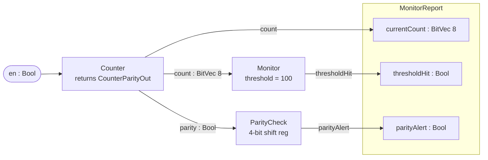

# Sparkle Tutorial — Extended (module structure & named record I/O)

A follow-up to `docs/Tutorial.md` that fills the gap between
"single counter" and "verify a SoC".

The "circuit-as-function" metaphor in `Tutorial.md` works for
single-output modules. But once a module produces more than one
signal, the caller has to unpack a tuple by position (`.fst`,
`.snd`, `.snd.fst`...), which kills readability. This tutorial
walks through the patterns that solve it: `let`-named outputs,
`declare_signal_state` for named records, and module composition.

All code in this tutorial **builds and runs**:

```bash
lake build TutorialExtended
lake exe tutorial-extended-run
```

Source: `tutorial-extended/TutorialExtended/Step{1,2,3,4}_*.lean`.

---

## Step 1: a single-output module

Just for grounding — the same starting point as `Tutorial.md`.

```lean
def counter8 {dom : DomainConfig}
    (en : Signal dom Bool) : Signal dom (BitVec 8) :=
  Signal.loop fun count =>
    let next := Signal.mux en (count + 1#8) count
    Signal.register 0#8 next
```

Single Signal in, single Signal out. No bundle, no unbind. The
generated Verilog has `_gen_count` (the loop variable) and
`_gen_next` (the mux output). The let-bindings drive the wire
names automatically.

---

## Step 2: two outputs — three patterns

This is where the design choice matters. We compute both a
counter and its parity. Three variants, all the same hardware:

### (a) Anonymous tuple

```lean
def counterAndParity_anon {dom : DomainConfig}
    (en : Signal dom Bool) : Signal dom (BitVec 8 × Bool) :=
  Signal.loop fun self =>
    let count    := Signal.fst self
    ...
    bundle2 (Signal.register 0#8 countNext)
            (Signal.register false parityNext)
```

Caller has to write:

```lean
let out  := counterAndParity_anon en
let cnt  := Signal.fst out
let par  := Signal.snd out
```

It's fine for a 2-tuple. But scale this to 122 elements (like the
RV32 SoC's state) and the call sites become unreadable
(`(out.snd.snd.fst).snd.fst` — what's that?).

The generated Verilog has anonymous wire names like
`_tmp_a_NNNN` for the registers — Verilator waveforms become
hard to read.

### (b) `let`-named outputs

```lean
def counterAndParity_letNamed {dom : DomainConfig}
    (en : Signal dom Bool) : Signal dom (BitVec 8 × Bool) :=
  Signal.loop fun self =>
    let count    := Signal.fst self
    ...
    let countOut  := Signal.register 0#8 countNext
    let parityOut := Signal.register false parityNext
    bundle2 countOut parityOut
```

The Verilog now has:

```verilog
logic [7:0] _gen_countOut;
logic       _gen_parityOut;
always_ff @(posedge clk) begin
  _gen_countOut  <= _gen_countNext;
  _gen_parityOut <= _gen_parityNext;
end
```

Named wires. Probes can `JIT.findWire "_gen_countOut"`. Verilator
waveforms have meaningful labels. **But callers still need
`.fst` / `.snd` to extract values** — the Lean type is still an
anonymous pair.

### (c) Named record via `declare_signal_state`

```lean
declare_signal_state CounterParityOut
  | count  : BitVec 8 := 0#8
  | parity : Bool     := false

def counterAndParity_record {dom : DomainConfig}
    (en : Signal dom Bool) : Signal dom CounterParityOut :=
  Signal.loop fun self =>
    let count      := CounterParityOut.count self
    ...
    let countOut   := Signal.register 0#8 countNext
    let parityOut  := Signal.register false parityNext
    bundleAll! [countOut, parityOut]
```

Now:

  - **Caller side**: `CounterParityOut.count out` instead of
    `Signal.fst out`. Type-safe, self-documenting.
  - **Verilog side**: still `_gen_countOut`, `_gen_parityOut` —
    same observability as (b).
  - **Free utilities**: `declare_signal_state` also generates
    `CounterParityOut.default`, `CounterParityOut.wireNames`, and
    `CounterParityOut.fromWires`, which the JIT probe layer can
    consume directly.

### Summary table

| Pattern | Caller projection | Wire name in Verilog | Lines added |
|---------|-------------------|----------------------|-------------|
| (a) anonymous | `.fst` / `.snd` | `_tmp_a_NNNN` | 0 |
| (b) `let`-named | `.fst` / `.snd` | `_gen_<bindingName>` | 2 |
| (c) record | `.fieldName` | `_gen_<bindingName>` | 4 (declaration) |

For modules with ≥ 3 outputs or any nesting, **always go with (c)**.

---

## Step 3: composing 3 modules with named record output

Build a small monitor pipeline:



Three modules feeding three named fields. The record output
`MonitorReport` keeps each output addressable by name (no
`.snd.snd.fst` chains).

```lean
declare_signal_state MonitorReport
  | currentCount : BitVec 8 := 0#8
  | thresholdHit : Bool     := false
  | parityAlert  : Bool     := false

def monitorTop {dom : DomainConfig}
    (en : Signal dom Bool) : Signal dom MonitorReport :=
  let cp        := counterAndParity_record en           -- nested record
  let count     := CounterParityOut.count cp            -- named projection
  let parity    := CounterParityOut.parity cp
  let thresholdHit := monitor count                     -- single-output
  let parityAlert  := parityCheck parity                -- single-output (with internal state)
  bundleAll! [count, thresholdHit, parityAlert]         -- pack into MonitorReport
```

The caller reads each field by name:

```lean
let report := monitorTop en
let counts := (MonitorReport.currentCount report).sample 110
let hits   := (MonitorReport.thresholdHit report).sample 110
let alerts := (MonitorReport.parityAlert  report).sample 110
```

No `.snd.snd.fst.snd.fst.snd.fst` chains. Compare the same
composition done with anonymous tuples — even at 3 fields it's
already painful to read, and gets exponentially worse with depth.

### The `parityCheck` shape (state + output)

`parityCheck` has internal state (a 4-bit shift register). The
common pattern when you have *both* state and an output is:

```lean
def parityCheck {dom : DomainConfig}
    (parity : Signal dom Bool) : Signal dom Bool :=
  Signal.snd (Signal.loop (α := ParityCheckState × Bool) fun self =>
    let stateOnly := Signal.fst self
    -- ... compute new state and output ...
    bundle2 nextState alert)
```

The loop body returns `(state, output)`. After `Signal.loop` ties
the state knot, `Signal.snd` peels off the output. This is
idiomatic — even though we're using a positional pair internally,
the *external* signature returns `Signal dom Bool` and callers
don't see the state at all.

If you have multiple outputs alongside state, replace the inner
`Bool` with another `declare_signal_state` record.

---

## Step 4: observability — let-binding ⇒ probe-friendly

Sparkle's CppSim backend aggressively inlines wires whose only
consumer is downstream logic. That's fine for correctness but
breaks observability: a wire that's been inlined is not emitted
as a struct field in the JIT C++, so `JIT.findWire` cannot
resolve its name.

This was the exact issue we hit when investigating the BitNet
"out = input" symptom from commit `9d0704e`. The probe asked for
`_gen_next` (BitNet's saturating-add output), but CppSim had
inlined that wire, so `findWire` returned a sentinel and
`getWire` returned 0 — making the output look broken when the
hardware was actually correct.

The fix is the same as Step 2's (b)/(c): bind the wire to a
top-level `let` (or expose it via a record field). That guarantees
the Sparkle elab adds it as a struct field that the probe can find.

```lean
-- Inlined: not probable.
def topInlined en : Signal dom (BitVec 8) :=
  fsm en

-- Exposed: probable as `_gen_fsmOut`.
def topExposed en : Signal dom (BitVec 8) :=
  let fsmOut := fsm en
  fsmOut

-- Record: probable as `_gen_result`, plus a typed accessor.
declare_signal_state TopReport
  | result : BitVec 8 := 0#8

def topRecord en : Signal dom TopReport :=
  let result := fsm en
  bundleAll! [result]
```

If you anticipate writing probes / waveform queries / formal
properties about an internal wire, **always** bind it. The cost
is one `let` line; the benefit is name-based access throughout
the verification stack.

For a worked debugging example, see
[`docs/BitNet_LTL_Investigation.md`](BitNet_LTL_Investigation.md).
The investigation took the wrong path for one round because
`_gen_next` was inlined; once we exposed it via
`SoCOutput.wireNames`, the LTL premises were directly observable
and the bug (a probe artifact, as it turned out) was localized
in 5 minutes.

---

## Running this tutorial

```bash
# Build all 4 step modules + the runner
lake build tutorial-extended-run

# Execute the demos for all 4 steps
lake exe tutorial-extended-run
```

Expected output (cycle counts may vary; values match the Lean
spec):

```
── Step 1: simple counter ──
Step 1 counter: [0x00#8, 0x01#8, 0x02#8, ...]

── Step 2: multi-output (anon vs let-named vs record) ──
(a) counts=[...] parity=[false, true, false, ...]
(b) counts=[...] parity=[false, true, false, ...]
(c) counts=[...] parity=[false, true, false, ...]

── Step 3: 3-module composition ──
counts (first 10): [0x00#8, 0x01#8, ..., 0x09#8]
counts around 100: [0x62#8, 0x63#8, 0x64#8, 0x65#8, 0x66#8]
thresholdHit at cycle 100: (some true)
parityAlert seen?         : false

── Step 4: observability ──
inlined : [0x03#8, 0x03#8, ...]
exposed : [0x03#8, 0x03#8, ...]
record  : [0x03#8, 0x03#8, ...]
```

To inspect the generated Verilog wire names for any step's
modules, use `#synthesizeVerilog`:

```lean
#synthesizeVerilog counterAndParity_record
-- Look in the build output for `_gen_countOut`, `_gen_parityOut`.
```

---

## Recap: when to use what

| Module shape | Use |
|--------------|-----|
| 1 output | plain `Signal dom T` return |
| 2 outputs | `bundle2` + let-bind both for named wires |
| ≥ 3 outputs OR nested | `declare_signal_state` record |
| Internal state + output | `Signal.snd (Signal.loop fun s ⇒ bundle2 nextState output)` pattern |
| Wire you'll probe / verify | always `let`-bind it at the top level |

This pattern set scales from 2-element BitNet MMIO output up to
the 122-element RV32 SoC state. The same record machinery is used
internally by `IP/RV32/SoC.lean`'s `declare_signal_state SoCState`.

---

## Where to go next

  - **`docs/Tutorial_LTL.md`** — Steps 5-7 of this tutorial cover
    LTL temporal-logic verification: ∀N-quantified Lean theorems,
    K-cycle preservation by induction, multi-premise bug-localization
    framework with the contrapositive pattern, and pointers to the
    production RV32 LTL catalog.
  - `docs/Verification_Framework.md` — broader proof-engineering
    techniques (oracle reduction, simp normalization, bv_decide).

## Cross-references

  - `tutorial-extended/TutorialExtended/Step1_SimpleCounter.lean` —
    single-output baseline.
  - `tutorial-extended/TutorialExtended/Step2_MultipleOutputs.lean` —
    three patterns side by side.
  - `tutorial-extended/TutorialExtended/Step3_ModuleComposition.lean` —
    3-module pipeline with named record top-level output.
  - `tutorial-extended/TutorialExtended/Step4_NamedObservability.lean` —
    let-binding ⇒ probe access.
  - `Sparkle/Core/StateMacro.lean` — the `declare_signal_state`
    macro that generates the record-as-tuple type, accessors,
    `wireNames`, and `fromWires` helpers.
  - `IP/RV32/SoC.lean::SoCState` — production-scale example with
    122 fields.
  - `docs/BitNet_LTL_Investigation.md` — debugging story where
    the let-bind / record observability pattern was the actual
    fix.
