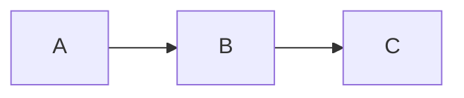

# Sparkle Jupyter notebooks

Interactive Sparkle examples that run in [xeus-lean](https://github.com/Verilean/xeus-lean)
— a Lean 4 Jupyter kernel with both native and WASM (browser) builds.

## Notebooks

| File | Topic |
|------|-------|
| `sparkle_diagrams.ipynb` | Authoring Sparkle modules with inline Mermaid block diagrams |

## How to render Mermaid diagrams in xeus-lean

Two paths, depending on whether the diagram is fixed or generated
from Lean code.

### Path 1 — fixed diagrams in Markdown cells

In **Jupyter Lab 4+** or **Notebook 7+**, a Mermaid code-fence
inside a Markdown cell renders directly:

````markdown

````

No Lean code, no helper imports. Best for diagrams that don't
change.

### Path 2 — runtime-generated diagrams via `#mermaid`

For diagrams that depend on Lean values (a register list, a
generated FSM, etc.), use the `MermaidHelper` module shipped with
this tutorial:

```lean
import TutorialExtended.MermaidHelper
open TutorialExtended.MermaidHelper

#mermaid "flowchart LR
  A --> B --> C"
```

`#mermaid` is a sugar over `#eval mermaid "..."`. The helper
emits the xeus-lean MIME marker
(`\x1bMIME:text/html\x1e<html>\x1b/MIME\x1e`) which the C++ FFI
forwards to Jupyter as a `display_data` HTML message. The HTML
includes a script tag that bootstraps Mermaid.js from a CDN if
the page hasn't loaded it yet.

You can build the diagram string programmatically:

```lean
def fanoutDiagram (src : String) (dsts : List String) : String :=
  dsts.foldl (fun acc d => acc ++ s!"\n  {src} --> {d}") "flowchart LR"

#eval mermaid (fanoutDiagram "Counter" ["Monitor", "ParityCheck", "Logger"])
```

## Setup

### Native xeus-lean

```bash
# Follow xeus-lean's docker-native tutorial:
# https://github.com/Verilean/xeus-lean/blob/main/docs/tutorials/docker-native.md

# Then in the Sparkle repo:
lake build TutorialExtended.MermaidHelper
# Open Jupyter Lab and load tutorial-extended/notebooks/sparkle_diagrams.ipynb
```

### Browser (JupyterLite WASM)

The WASM build of xeus-lean has limitations (no `Signal.loop`),
but `MermaidHelper` is pure-IO and works fine. Visit
[the JupyterLite site](https://verilean.github.io/xeus-lean/lab/index.html)
and paste the cell contents from `sparkle_diagrams.ipynb`.

## How the helper works

`tutorial-extended/TutorialExtended/MermaidHelper.lean` defines:

```lean
def mkMarker (mime : String) (content : String) : String :=
  let esc := Char.ofNat 0x1B
  let rs  := Char.ofNat 0x1E
  s!"{esc}MIME:{mime}{rs}{content}{esc}/MIME{rs}"

def html (content : String) : IO Unit :=
  IO.println (mkMarker "text/html" content)
```

xeus-lean's REPL frontend (`src/REPL/JSON.lean`) explicitly
preserves ESC (0x1B) bytes so these markers survive the
`MessageLog` round-trip. The C++ interpreter (`src/xeus_ffi.cpp`)
then parses the markers out and constructs the proper Jupyter
display payload:

```cpp
if (result.contains("text/html") || result.contains("image/svg+xml")) {
    pub_data = result;
}
publish_execution_result(execution_count, std::move(pub_data), ...);
```

So `mermaid` produces a string, the kernel's FFI promotes it to a
typed display payload, Jupyter renders it as HTML, and Mermaid.js
turns the HTML into the SVG you see in the notebook.

## Testing the helper outside Jupyter

```bash
lake exe tutorial-mermaid-test
```

Prints the raw MIME marker to stdout (useful for piping or for
visual inspection of what xeus-lean would receive).
